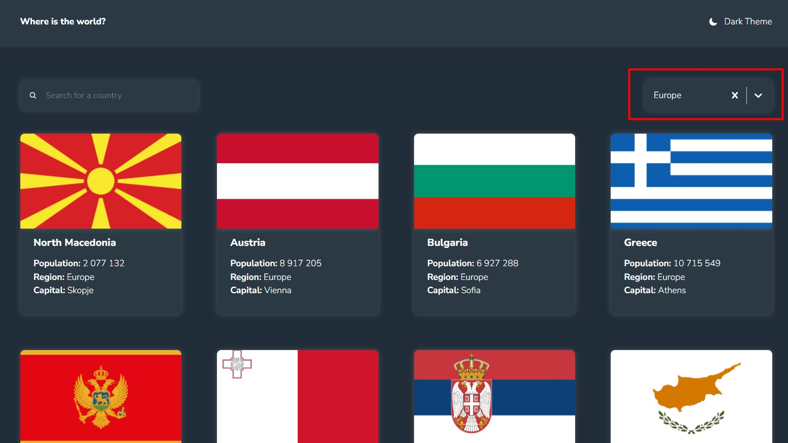
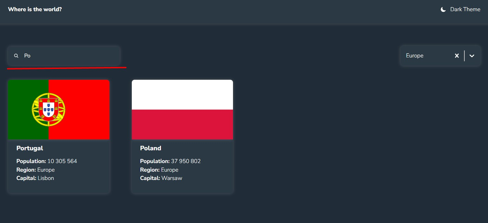
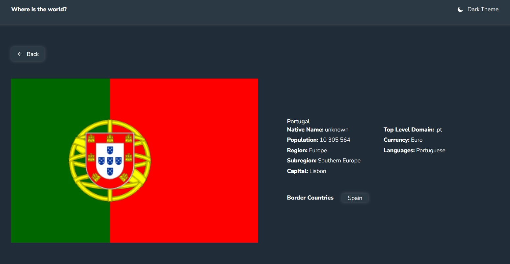

## Description

This SPA application was created to retrieve information about different countries.
Here, I used React, Styled-components, and the Restcountries API.
It is adapted for all standard mobile device screen sizes.

## Tools:

- react.js
- react-icons
- react-router-dom v6
- react-select
- styled-components
- axios
- restcountries API

## Features:

- Filtering countries by region
  
- Filtering countries by country name
  
- Go to a separate country page by clicking on it
  
- Switching theme
- Going to Home page by clicking on "Where is the world?" in Header

## Running the project locally

- Clone the branch to your computer.
- Run the **npm run dev** command in the integrated terminal of your IDE to run the project locally.
- Open the following link to see the project if it hasn't opened automatically: http://localhost:5173.
- Delete basename from routing file in routing.jsx file and in vite.config.js
